# Mission Flow Diagram

This document provides a comprehensive visualisation of the autonomous tyre inspection mission state machine. The diagram reflects the actual implementation in `inspection_manager_node` and `mission_state_machine.py`.

## Legend

| Acronym | Meaning |
|---------|---------|
| **FL** | Front Left tyre |
| **FR** | Front Right tyre |
| **RL** | Rear Left tyre |
| **RR** | Rear Right tyre |

**Tyre order:** The robot visits tyres in **distance order**—nearest first, then 2nd, 3rd, and 4th nearest. Nav2 paths around the vehicle to reach far-side tyres.

---

## Mission State Machine (Mermaid)

```mermaid
flowchart TD
    subgraph Startup
        IDLE([IDLE])
        INIT([INIT])
        IDLE -->|"start_mission / TF+Nav2 ready"| INIT
        INIT -->|"sensor_healthy / sensor_health_timeout"| SEARCH_VEHICLE
        IDLE -->|"no_vehicles_configured"| DONE
        IDLE -->|"tf_unavailable_at_start / nav2_unavailable"| ERROR
    end

    subgraph VehicleSearch["Vehicle Search"]
        SEARCH_VEHICLE([SEARCH_VEHICLE])
        PATROL_SEARCH([PATROL_SEARCH])
        TURN_IN_PLACE_SEARCH([TURN_IN_PLACE_SEARCH])
        WAIT_VEHICLE_BOX([WAIT_VEHICLE_BOX])
        TURN_IN_PLACE_VEHICLE([TURN_IN_PLACE_VEHICLE])
        
        SEARCH_VEHICLE -->|"vehicles_available"| WAIT_VEHICLE_BOX
        SEARCH_VEHICLE -->|"all_detected_vehicles_inspected"| DONE
        SEARCH_VEHICLE -->|"vehicle_search_timeout / vehicle_search_exhausted"| DONE
        SEARCH_VEHICLE -->|"patrol_search"| PATROL_SEARCH
        PATROL_SEARCH -.->|"tick"| SEARCH_VEHICLE
        SEARCH_VEHICLE -->|"no vehicle, rotate"| TURN_IN_PLACE_SEARCH
        TURN_IN_PLACE_SEARCH -.->|"rotation done"| SEARCH_VEHICLE
    end

    subgraph ApproachVehicle["Approach Vehicle"]
        APPROACH_VEHICLE([APPROACH_VEHICLE])
        WAIT_VEHICLE_BOX -->|"approach_dispatched (goal sent)"| APPROACH_VEHICLE
        WAIT_VEHICLE_BOX -->|"approach_dispatched (nearest tyre first)"| INSPECT_TIRE
        WAIT_VEHICLE_BOX -->|"vehicle lost, rotate"| TURN_IN_PLACE_VEHICLE
        TURN_IN_PLACE_VEHICLE -.->|"rotation done"| WAIT_VEHICLE_BOX
        APPROACH_VEHICLE -->|"Nav2 arrived at standoff"| WAIT_TIRE_BOX
        APPROACH_VEHICLE -->|"approach_timeout / progress_stall"| WAIT_VEHICLE_BOX
    end

    subgraph TireInspection["Tyre Inspection Loop (×4 tyres)"]
        WAIT_TIRE_BOX([WAIT_TIRE_BOX])
        TURN_IN_PLACE_TIRE([TURN_IN_PLACE_TIRE])
        INSPECT_TIRE([INSPECT_TIRE])
        FACE_TIRE([FACE_TIRE])
        WAIT_WHEEL_FOR_CAPTURE([WAIT_WHEEL_FOR_CAPTURE])
        VERIFY_CAPTURE([VERIFY_CAPTURE])
        
        WAIT_TIRE_BOX -->|"tire_detected / planned_tire_fallback"| INSPECT_TIRE
        WAIT_TIRE_BOX -->|"single_tire_at_goal (at pose)"| WAIT_WHEEL_FOR_CAPTURE
        WAIT_TIRE_BOX -->|"no tire, rotate"| TURN_IN_PLACE_TIRE
        TURN_IN_PLACE_TIRE -.->|"rotation done"| WAIT_TIRE_BOX
        
        INSPECT_TIRE -->|"Nav2 arrived at tyre"| FACE_TIRE
        INSPECT_TIRE -->|"tire_approach_timeout / progress_stall / tire_skipped_unreachable"| WAIT_TIRE_BOX
        
        FACE_TIRE -->|"faced tyre"| VERIFY_CAPTURE
        FACE_TIRE -->|"capture_require_wheel_detection"| WAIT_WHEEL_FOR_CAPTURE
        FACE_TIRE -->|"face_tire_timeout"| WAIT_TIRE_BOX
        
        WAIT_WHEEL_FOR_CAPTURE -->|"wheel detected, trigger photo"| VERIFY_CAPTURE
        WAIT_WHEEL_FOR_CAPTURE -->|"capture_skipped_no_wheel (timeout)"| WAIT_TIRE_BOX
        
        VERIFY_CAPTURE -->|"verify_success, more tyres"| WAIT_TIRE_BOX
        VERIFY_CAPTURE -->|"verify_failure, retry next"| WAIT_TIRE_BOX
    end

    subgraph Completion["Completion"]
        NEXT_VEHICLE([NEXT_VEHICLE])
        DONE([DONE])
        ERROR([ERROR])
        
        VERIFY_CAPTURE -->|"verify_success, all 4 tyres"| NEXT_VEHICLE
        VERIFY_CAPTURE -->|"verify_failure, skip vehicle"| NEXT_VEHICLE
        WAIT_TIRE_BOX -->|"all tires done (planned)"| NEXT_VEHICLE
        
        NEXT_VEHICLE -->|"more vehicles"| WAIT_VEHICLE_BOX
        NEXT_VEHICLE -->|"all_vehicles_inspected"| DONE
        
        APPROACH_VEHICLE -->|"dispatch_failures / hard_mission_timeout"| ERROR
        INSPECT_TIRE -->|"dispatch_failures"| ERROR
        SEARCH_VEHICLE -->|"spin_protection"| ERROR
        WAIT_VEHICLE_BOX -->|"spin_protection"| ERROR
        WAIT_TIRE_BOX -->|"spin_protection"| ERROR
        VERIFY_CAPTURE -->|"spin_protection"| ERROR
        NEXT_VEHICLE -->|"tf_unavailable"| ERROR
    end
```



---

## Simplified Flow (High-Level)

```
IDLE → INIT → SEARCH_VEHICLE
         ↓
    [Vehicle detected]
         ↓
WAIT_VEHICLE_BOX → APPROACH_VEHICLE (or INSPECT_TIRE if nearest tyre first)
         ↓
    [Nav2 arrived]
         ↓
WAIT_TIRE_BOX ←→ INSPECT_TIRE ←→ FACE_TIRE ←→ WAIT_WHEEL_FOR_CAPTURE ←→ VERIFY_CAPTURE
         ↑                                                                      |
         |________________________ [Next tyre] _________________________________|
         |
         └── [All 4 tyres] → NEXT_VEHICLE → WAIT_VEHICLE_BOX (more) or DONE
```

---

## Key Behaviours

1. **First goal = nearest tyre:** With `approach_nearest_corner: true`, the first dispatched goal is the **nearest tyre corner** (not a generic standoff). The robot may go directly to INSPECT_TIRE.
2. **Planned fallback:** If no wheel is detected within timeout, the mission uses **planned tyre positions** (FL, FR, RL, RR) derived from the vehicle bounding box.
3. **Spin protection:** If the same wait/return cycle repeats `max_state_repeats` (default 3) times without progress, the mission transitions to ERROR.
4. **Multi-vehicle:** After 4 tyres, NEXT_VEHICLE loops back to WAIT_VEHICLE_BOX if more vehicles are in the queue.

See [MISSION_PIPELINE.md](MISSION_PIPELINE.md) for detailed phase descriptions and [RUNBOOK.md](../RUNBOOK.md) for operational procedures.
