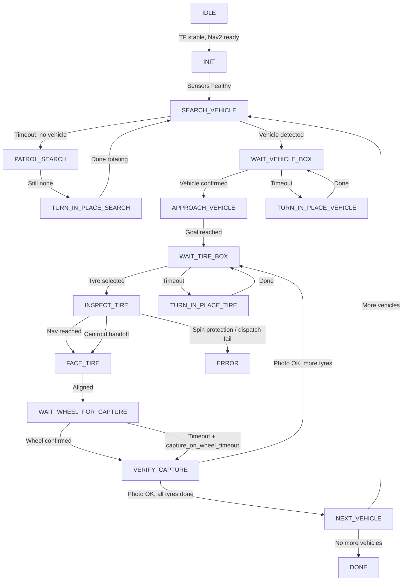

# Mission Flow

Authoritative mission state flow for the autonomous tyre inspection robot.
Source of truth: `mission_state_machine.py` and `inspection_manager_node.py`.

---

## States

| State | Description |
|-------|-------------|
| `IDLE` | Startup wait; TF and sensor health checks |
| `INIT` | Verify Aurora/sensor health, wait for TF stable |
| `SEARCH_VEHICLE` | No vehicle yet; watch for first detection |
| `PATROL_SEARCH` | Slow forward patrol when no vehicles detected |
| `TURN_IN_PLACE_SEARCH` | Rotate in place during search |
| `WAIT_VEHICLE_BOX` | Vehicle candidate received; confirm over N frames |
| `TURN_IN_PLACE_VEHICLE` | Rotate to improve vehicle detection angle |
| `APPROACH_VEHICLE` | Nav2 NavigateToPose to standoff near vehicle |
| `WAIT_TIRE_BOX` | At vehicle; wait for and select next tyre target |
| `TURN_IN_PLACE_TIRE` | Rotate to find tyres |
| `INSPECT_TIRE` | Nav2 NavigateToPose to tyre inspection standoff |
| `FACE_TIRE` | Rotate in place to face tyre before capture |
| `WAIT_WHEEL_FOR_CAPTURE` | At goal: require wheel detection in view before photo |
| `VERIFY_CAPTURE` | Wait for `capture_result` from photo_capture_service |
| `FOLLOW_WAYPOINTS_BATCH` | FollowWaypoints batch for full tyre perimeter |
| `NEXT_VEHICLE` | All tyres on this vehicle done; move to next |
| `DONE` | Mission complete |
| `ERROR` | Non-recoverable failure; stops motion |

---

## State Transitions (Simplified)

```mermaid
graph TD
    IDLE -->|TF stable, Nav2 ready| INIT
    INIT -->|Sensors healthy| SEARCH_VEHICLE
    SEARCH_VEHICLE -->|Vehicle detected| WAIT_VEHICLE_BOX
    SEARCH_VEHICLE -->|Timeout, no vehicle| PATROL_SEARCH
    PATROL_SEARCH -->|Still none| TURN_IN_PLACE_SEARCH
    TURN_IN_PLACE_SEARCH -->|Done rotating| SEARCH_VEHICLE
    WAIT_VEHICLE_BOX -->|Vehicle confirmed| APPROACH_VEHICLE
    WAIT_VEHICLE_BOX -->|Timeout| TURN_IN_PLACE_VEHICLE
    TURN_IN_PLACE_VEHICLE -->|Done| WAIT_VEHICLE_BOX
    APPROACH_VEHICLE -->|Goal reached| WAIT_TIRE_BOX
    WAIT_TIRE_BOX -->|Tyre selected| INSPECT_TIRE
    WAIT_TIRE_BOX -->|Timeout| TURN_IN_PLACE_TIRE
    TURN_IN_PLACE_TIRE -->|Done| WAIT_TIRE_BOX
    INSPECT_TIRE -->|Nav reached| FACE_TIRE
    INSPECT_TIRE -->|Centroid handoff| FACE_TIRE
    FACE_TIRE -->|Aligned| WAIT_WHEEL_FOR_CAPTURE
    WAIT_WHEEL_FOR_CAPTURE -->|Wheel confirmed| VERIFY_CAPTURE
    WAIT_WHEEL_FOR_CAPTURE -->|Timeout + capture_on_wheel_timeout| VERIFY_CAPTURE
    VERIFY_CAPTURE -->|Photo OK, more tyres| WAIT_TIRE_BOX
    VERIFY_CAPTURE -->|Photo OK, all tyres done| NEXT_VEHICLE
    NEXT_VEHICLE -->|More vehicles| SEARCH_VEHICLE
    NEXT_VEHICLE -->|No more vehicles| DONE
    INSPECT_TIRE -->|Spin protection / dispatch fail| ERROR
```

---

## Safety Gating in `_tick`

The main timer tick runs at 1 Hz and enforces these gates **before** any state logic:

1. **Nav2 unavailable** – pauses mission tick, logs event
2. **TF watchdog** – pauses if `slamware_map→base_link` fails for `tf_watchdog_timeout` seconds
3. **`require_nav_permitted`** – blocks dispatch if `/stereo/navigation_permitted` is false
4. **Dispatch fail count** – aborts to ERROR after `dispatch_fail_abort_count` consecutive failures
5. **`cmd_vel` watchdog** – warns if no motor command seen after goal dispatch
6. **Approach timeout** – cancels stuck navigation after `approach_timeout_s`
7. **Hard mission timeout** – transitions to ERROR after `hard_mission_timeout` seconds

---

## Key Parameters

| Parameter | Default | Description |
|-----------|---------|-------------|
| `vehicle_confirmations_required` | 3 | Frames before vehicle is committed |
| `tire_confirmations_required` | 2 | Frames before tyre is selected |
| `vehicle_search_timeout_s` | 180 | Total search time before mission ends |
| `tire_search_timeout_s` | 90 | Tyre search time before fallback or skip |
| `approach_timeout_s` | 120 | Max time for a single Nav2 goal |
| `face_tire_timeout_s` | 20 | Max time for final tyre alignment |
| `capture_wheel_wait_timeout_s` | 8 | Max wait for wheel in WAIT_WHEEL_FOR_CAPTURE |
| `max_state_repeats` | 3 | Spin protection threshold (cycles → ERROR) |
| `tf_unavailable_abort_s` | 60 | Continuous TF failure → ERROR |

See [MISSION_PIPELINE.md](MISSION_PIPELINE.md) for per-phase details and [RUNBOOK.md](../RUNBOOK.md) for launch procedures.
